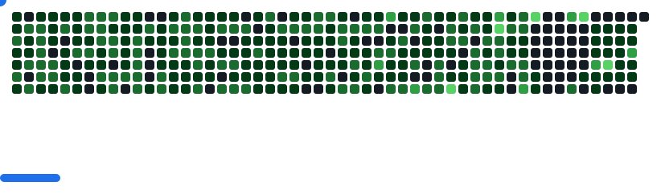

<a href="#"></a>


<h3 align="center">
  <a href="https://git.io/typing-svg">
    
  </a>
</h3>

---

<h1 align="center">Hi 👋, I'm dvlan</h1>


<h3 align="center">A passionate AI4S developer and Chemical Engineer from China</h3>

<p align="left">  </p>


- 💬 Ask me  **all about AI4S, LCA, ChemE and Digital Twin**

- ⚡ Fun fact **I love Marathon**

<h3 align="left">📊 GitHub Stats</h3>

###

<div style="text-align: center;">
  
  
  
</div>

###

<h3 align="left">🏆 GitHub Trophies</h3>

###

  
  
###

<picture>
  <source
    media="(prefers-color-scheme: dark)"
    srcset="images/breakout-dark.svg"
  />
  <source
    media="(prefers-color-scheme: light)"
    srcset="images/breakout-light.svg"
  />
  
</picture>

---

  <a href="https://github.com/ashutosh00710/github-readme-activity-graph"></a>

---
---

<!-- <p align="center">
	<table>
		<tr>
		<td align="center">
		    <picture>
		    <source media="(prefers-color-scheme: dark)"  srcset="https://cdn.jsdelivr.net/gh/dvlan26/dvlan26/profile-3d-contrib/profile-night-green.svg?clear=1" />
		    <source media="(prefers-color-scheme: light)" srcset="https://cdn.jsdelivr.net/gh/dvlan26/dvlan26/profile-3d-contrib/profile-season-animate.svg?clear=1" />
		    
		    </picture>
		</td>
		</tr>
	</table>
</p>

<h3 align="left"></h3>
<p align="left">
</p> -->

<!-- <p align="center">
		    <picture>
		    <source media="(prefers-color-scheme: dark)"  srcset="https://raw.githubusercontent.com/dvlan26/dvlan26/output/github-contribution-grid-snake-dark.svg" width="1000" />
		    <source media="(prefers-color-scheme: light)" srcset="https://raw.githubusercontent.com/dvlan26/dvlan26/output/github-contribution-grid-snake.svg" width="1000" />
		    
		    </picture>
</p> -->

# 💻 My favorite tools and technologies
<div style="display: flex; align-items: flex-start; align: center">
<table align="center">
  <tr>
    <td align="center" width="96">
        
      <br>React
    </td>
    <td align="center" width="96">
      <a href="#macropower-tech">
        
      </a>
      <br>Python
    </td>
    <td align="center" width="96">
        
      <br>JavaScript
    </td>
    <td align="center" width="96">
        
      <br>C++
    </td>
    <td align="center" width="96">
        
      <br>Webpack
    </td>
    <td align="center" width="96">
        
      <br>MySQL
    </td>
    <td align="center" width="96">
        
      <br>TypeScript
    </td>
    <td align="center" width="96">
        
      <br>AWS
    </td>
    <td align="center" width="96">
        
      <br>C#
    </td>
  </tr>
  <tr>
  <td align="center" width="96">
        
      <br>Django
    <td align="center" width="96">
        
      <br>Github
    </td>
    <td align="center" width="96"> 
        
      <br>Git
    </td>
    <td align="center"  width="96">
        
      <br>Laravel
    </td>
    <td align="center"  width="96">
        
      <br>HTML5
    </td>
    <td align="center" width="96">
        
      <br>CSS
    </td>
    <td align="center"  width="96">
        
      <br>Bootstrap
    </td>
    <td align="center" width="96">
        
      <br>Tailwind
    </td>
    <td align="center" width="96">
        
      <br>jQuery
    </td>
  </tr>
 <tr>
      <td align="center" width="96">
        
      <br>MongoDB
    </td>
        <td align="center" width="96">
        
      <br>Nodejs
      </td>
      </td>
    <td align="center" width="96">
        
      <br>PHP
    </td>
            <td align="center" width="96">
        
      <br>VsCode
    </td>
              <td align="center" width="96">
        
      <br>WordPress
    </td>
              <td align="center" width="96">
        
      <br>Vue
    </td>
              <td align="center" width="96">
        
      <br>Sass
    </td>
              <td align="center" width="96">
        
      <br>GraphQL
    </td>
    <td align="center" width="96">
        
      <br>PostgreSQL
    </td>
 </tr>
</table>
<br><br>


</div>

---

###


```
████████████████████████████████████████████████████████████  ██╗  ██╗███████╗██╗     ██╗      ██████╗
████████████████████████████████████████████████████████████  ██║  ██║██╔════╝██║     ██║     ██╔═══██╗
███████████████████████████████████`.        ╙██████████████  ███████║█████╗  ██║     ██║     ██║   ██║
████████████████████████████████▀  ¿▓▓▓▓▓▓▓▓▄/ "████████████  ██╔══██║██╔══╝  ██║     ██║     ██║   ██║
██████████████████████████████▀.  ▓▓▓▓▓▓▓▓▓▓▓▓   ▐██████████  ██║  ██║███████╗███████╗███████╗╚██████╔╝▄█╗
██████████████████████████████ `  ▓▓▓▓▓▓▓▓▓▓▓▓  ` ██████████  ╚═╝  ╚═╝╚══════╝╚══════╝╚══════╝ ╚═════╝ ╚═╝
██████████████████████████████ `  ▓▓▓▓▓▓▓▓▓▓▓▓   ▄██████████
▀██████████████████████████████▌  ▀▀▓▓▓▓▓▓▓▌╓╖. ████████████  ███╗   ██╗██╗ ██████╗███████╗  ████████╗ ██████╗
█▄▀██████████████████████████████▄ ╩╦╙▀▀▀▀▀ ╣`,█████████████  ████╗  ██║██║██╔════╝██╔════╝  ╚══██╔══╝██╔═══██╗
▄▀█▄╙█████████████████████▀▀▀▀█████▄▄ .... ,▄███████▀███████  ██╔██╗ ██║██║██║     █████╗       ██║   ██║   ██║
██▄▀█▄╙█████████████████▀  ╪╢%╦══~╓,└ ╚▒▒▒ ╙▀|,╓╓═╤H   ▀████  ██║╚██╗██║██║██║     ██╔══╝       ██║   ██║   ██║
█▀▀▀-▀█▌▄▀█████████████   ║▒▒▒▒▒▒▒▒▒▒╢╦ ╘ -╣▒▒▒▒▒▒▒▒▒╢╕   ▀█  ██║ ╚████║██║╚██████╗███████╗     ██║   ╚██████╔╝
██▄▀██└║▄▄▄████████████▄          ═╕╕╕╕╕═╕═══════       ▄▄▄▄  ╚═╝  ╚═══╝╚═╝ ╚═════╝╚══════╝     ╚═╝    ╚═════╝
████▄▀█▌║███  ████████▌         ╕   ╩▒▒▒▒▒▒▒▒▒Ñ          ███
██████▌Ö▓▌   ▀██████████`╔▒▒╣ █ ▒▒m   ╚▒╢▒▒▒╩ -╣▒ ▌ ▒▒▒ ████  ███╗   ███╗███████╗███████╗████████╗  ██╗   ██╗ ██████╗ ██╗   ██╗
████ -"" ∞╙,▀.╙▀███████╜ ▒▒▒ ▄█ Ñ   -   S.  ═▒▒▒▒ █ ║▒▒╕└███  ████╗ ████║██╔════╝██╔════╝╚══██╔══╝  ╚██╗ ██╔╝██╔═══██╗██║   ██║
████████▄ -«   ∞▄.▀",╓═     ╒██   ═╣▒▒ `Ñ╛        █▌ ▒▒▒ ███  ██╔████╔██║█████╗  █████╗     ██║      ╚████╔╝ ██║   ██║██║   ██║
█████████▌ º     ╤╣▒╣╩^",▄▄███▀  ▒▒╣"     ''''''' ▀▀     `██  ██║╚██╔╝██║██╔══╝  ██╔══╝     ██║       ╚██╔╝  ██║   ██║██║   ██║
█████████  ▌       ▄▄████████─         ---------    L'▒▒▒ ██  ██║ ╚═╝ ██║███████╗███████╗   ██║        ██║   ╚██████╔╝╚██████╔╝
▀▀▀▀▀▀▀▀▀▀▀▀▀-     ▀▀▀▀▀▀▀▀▀▀       '╧╧╧╧╧╧╧╧╧`     ╚ ╧╧╧- ▀  ╚═╝     ╚═╝╚══════╝╚══════╝   ╚═╝        ╚═╝    ╚═════╝  ╚═════╝
```

---


<p align="center">
  
  
  
  
  
</p>	
</div>

<h3 align="center">
  
</h3>

<a href="#"></a>
